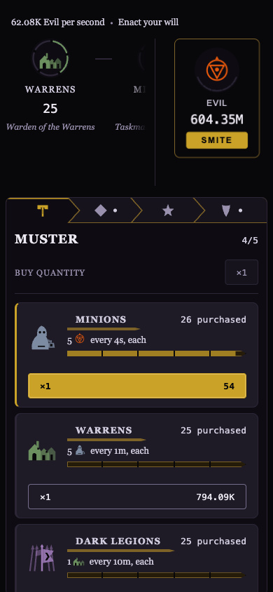
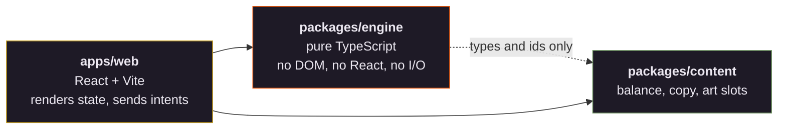
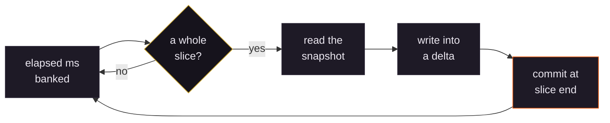
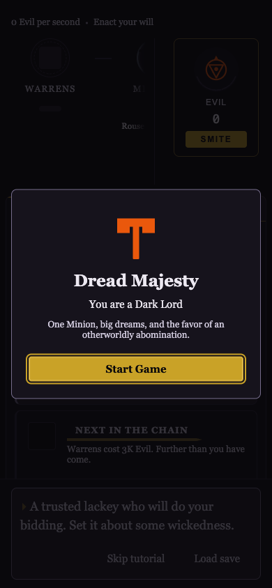
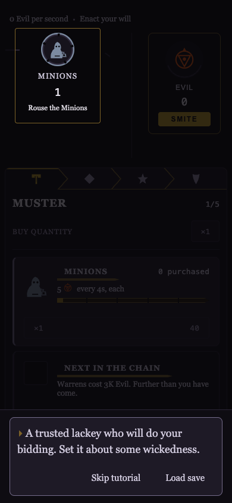

<div align="center">


<h1>Dread Majesty</h1>

<p><strong>Fortresses raise Dark Legions. Legions take ground that becomes Warrens.<br />
Warrens breed Minions. Minions generate Evil.</strong></p>

<p>Generators produce other generators, so production compounds.<br />
That cascade is the game, and showing it is the point of the interface.</p>

<p>
  <a href="https://dreadmajesty.netlify.app"><strong>Play it&nbsp;→</strong></a>
</p>

<a href="https://github.com/mgballou/dread-majesty/actions/workflows/ci.yml"></a>

</div>

<br />



---

## The chain

Five rungs. Each one spends a cycle and pays out in the rung below it, so buying at the top
pays at the bottom several steps later.

|                                                               | Tier             | One cycle pays | Cycle | First one costs                |
| :-----------------------------------------------------------: | ---------------- | -------------- | ----- | ------------------------------ |
|    | **Thrones**      | 1 Fortress     | 90m   | 1.6e12 Evil                    |
|  | **Fortresses**   | 1 Dark Legion  | 30m   | 6e8 Evil                       |
|    | **Dark Legions** | 1 Warren       | 10m   | 6e7 Evil                       |
|    | **Warrens**      | 5 Minions      | 60s   | 3,000 Evil                     |
|    | **Minions**      | 5 Evil         | 4s    | 160 Evil                       |
|      | **Evil**         | —              | —     | what everything is bought with |

**Nothing runs until somebody makes it run.** Every tier starts manual: you rouse it from
its node on the chain, it runs one cycle, pays out and stops. Appointing that tier's
Overseer, for Evil, automates it for good. That is the opening loop, and it is bought off
one tier at a time.

---

## Running it

```bash
pnpm install
pnpm dev        # http://localhost:5173
pnpm check      # typecheck + lint + test
pnpm build      # production bundle
pnpm harness    # headless balance run
```

Node 22 or newer.

---

## Layout



Dependencies flow one way. The engine takes the content **types and the id vocabulary**;
the balance numbers arrive as a function argument, and lint bars the engine from importing
them. Engine tests run against fixtures, never against shipping content, so a balance
change cannot fail an engine test.

---

## How it works

### The engine is pure

No DOM, no React, no I/O, no clock. Time and seeds enter as arguments at the boundary.
That single rule buys most of what follows: every engine test is a plain assertion, and
replay verification is available later for free.

### One simulation, fixed timestep

Elapsed milliseconds are banked and spent in whole slices, so a cycle finishing depends on
how much time passed, never on how the browser scheduled frames. Coming back after four
hours runs the same `step` the same number of times as sitting there for four hours would.
There is no second code path for offline, no aggregate shortcut, no closed form.



Nothing produced within a slice affects anything else within it. That is why tier order
does not matter and why there is no tie-break rule to get wrong.

### Every count is a `Decimal`

`break_eternity.js`, never a JS number, not even early on when the values are small. The
game reaches 1e30 in a week of play and past 1e300 eventually. Mixed arithmetic is the bug
you find six months later.

### Saves migrate, and shipped steps are never edited

Ten versions so far, each a pure function from one blob shape to the next, applied in
sequence. A mistake gets another step appended rather than a fix in place, because there is
no way to tell which saves already passed through the old one. Version 10 exists for
exactly that reason.

### Balance is measured, not guessed

`pnpm harness` runs the real engine headless for seven simulated days and reports when each
tier arrives, when each goes obsolete, what the growth exponent is, and whether the prestige
loop converges or runs away. Every number in `packages/content` was fitted against it.

It earns its keep on the failures nothing else catches. A prestige curve that read as
balanced diverged to ×634 after two resets. Its replacement was correct in every figure but
had lost its zero, and paid 213 souls for thirty-four Evil. Neither was visible by reading
the code.

The harness is a script and never gates CI — it is a measuring instrument, not a test.

---

## The first run

| The front door                                                                                                 | The tour                                                                                                                                                               |
| -------------------------------------------------------------------------------------------------------------- | ---------------------------------------------------------------------------------------------------------------------------------------------------------------------- |
|  |  |

The title screen shows only on a genuinely fresh run. Anything with a save behind it gets
the return summary instead.

Then a line at the foot of the screen names the next thing to do and holds back every other
control until it is done, then clears and leaves the player alone until the next moment worth
teaching. Six moments are gated that way. A seventh gates nothing and simply remarks on the
Minions the first Warren delivered without being asked, which is the whole cascade in one
sentence. The tour is skippable at the first prompt and never returns.

The first time you smite, something else starts talking. It wants you to do it again
immediately, which is the wrong move, and it argues better the longer you refuse.

---

## Where things stand

**M1 through M4 have had a first pass. The game is playable end to end.**

The engine is complete and tested: fixed-timestep simulation, an exact cost curve and
max-buy, purchases, manual cycles and Overseers, milestone and prestige multipliers,
achievements, unlock latching, offline catch-up, and versioned saves.

`apps/web` is the designed interface, not a shell — the live chain diagram, the buy rail
with exactly one accented spend, the prestige panel, the deeds wall, the ledger, and the
offline-return screen. Saves go to IndexedDB and export as a pasteable blob. Sound is
synthesized in code and muted until asked for.

There is a dev workbench at the foot of the page: jump to any point of progression, set any
resource, appoint or dismiss every Overseer, simulate an absence. It is stripped from
production builds and it deliberately looks nothing like the game.

Every player-facing string lives in `packages/content/src/v1/copy.ts`. Adding an achievement
without copy fails typecheck.

**Economy tuning is ongoing.** The numbers have had several measured passes, and the current
ones are the best answer so far rather than a finished one: Warrens at 11 minutes, Dark
Legions at 41 minutes, Fortresses at 1h23m, Thrones at 2h30m, first prestige at 42 minutes.
Expect them to move. They want real players more than another harness run. Re-run
`pnpm harness` after touching any number in `packages/content`.

**Not done:** real art. Every slot renders a generated SVG fallback — including the marks in
this file, which are the same drawings the game ships.

---

## Reading order

1. [**The design spec**](docs/superpowers/specs/2026-08-03-dread-majesty-design.md) — the
   decisions and why each one went the way it did. Everything else amends it.
2. [**`CLAUDE.md`**](CLAUDE.md) — how to write code here. The five engine rules, in full.
3. [**`docs/ui-sensibility.md`**](docs/ui-sensibility.md) — the interface rules the genre
   usually breaks, and why this one keeps them. Normative for `apps/web`.
4. [**`docs/`**](docs/) — every spec and plan, indexed, with what each one still governs.

---

## Using this

**No license, on purpose.** The source is here to be read, not reused: all rights reserved.
Read it, learn from it, quote it with attribution. If you want to do something else with it,
ask.
