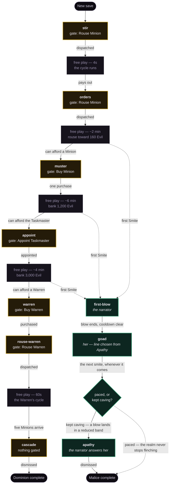

# Onboarding

**Status:** built
**Supersedes:** the first-run tour of `first-run-tour` / PR #8, in full

A new player is taught the compounding loop by being walked through it, one action at a
time, inside the game rather than on top of it. A second voice teaches Smite by tempting
the player into misusing it.

---

## 1 The fault

The shipped tour is five modal cards over a dimmed screen, walked before play begins.
Playtest read it as wrong in three separate ways, and they are worth separating because
only one of them is a copy problem.

**It runs outside the game.** The player is told about rousing rather than rousing.
Every card is an assertion they have no way to check, delivered before they have seen a
single number move. The opening card even sets expectations about itself — "this takes
about a minute and you can leave whenever you like" — which is a thing to say about a
tour, not a thing to say to somebody who has just started a game.

**It explains the ending.** The last card, titled "This is the whole game", flattens the
cascade into a sentence and hands it over before the player has bought a second
generator. The cascade is the payoff of the first ten minutes. Naming it up front spends
the payoff and teaches nothing, because nothing on screen yet demonstrates it.

**It never mentions Smite.** The one verb available from the first second, and the tour
walks past it.

The copy is also wrong in places — an Overseer described as a thing that "keeps it
turning while you are away", which is not what an Overseer does — but rewriting the
cards would leave the first two faults untouched. The form is the fault.

---

## 2 The model

Three rules. Everything else in this spec follows from them.

**A beat shows when three things hold.** It has not been consumed; every earlier beat in
its track has been consumed; and its `ready` predicate holds on the current state.

**A beat is consumed the moment the player performs its named action** — the dispatch,
not the payout.

**While a beat is showing, only its named action is live. While no beat is showing,
nothing is gated.**

The second rule is what makes prompts transient. A beat clears on the click, so the
screen is clean while the cycle it started runs. The third rule is what makes gating
survivable: the player is held only at the moment of a lesson, and is free for the
minutes between.

Rule 1's second clause makes "one prompt at a time, in order" structural rather than
something a reader has to keep in their head. Its third clause is where the obvious edge
case dies, and it is worth walking, because the fix is a consequence of the rule rather
than a special case:

> A player banks 3,000 Evil without ever appointing the Taskmaster. `appoint` is the
> earliest unconsumed beat and its `ready` holds, so it shows and gates. They appoint,
> spending 1,200, and hold 1,800. `warren` is now the earliest unconsumed beat — but its
> `ready` is "can afford a Warren", which is false. **So it does not show, and nothing is
> gated.** The player is free until they bank 3,000, at which point it appears.

For every purchase beat, `ready` is *can afford the named action* — the same predicate
that decides whether to show it. A beat can therefore never gate the player to something
they cannot buy.

---

## 3 The two tracks

**Dominion** runs once, on a genuinely new save, and ends at the first Warren's first
cycle. It gates.

**Malice** is reactive: it begins the first time the player smites, whenever that is, and
runs in parallel with whatever Dominion is doing. It never gates and never offers an
action. It only speaks.



Gold is Dominion, verdigris is Malice, grey is free play. The dashed edges into
`first-blow` are the point of the diagram: **Malice has no fixed place in the run.** It
starts wherever the player first reaches for Smite, which is most often in one of the
long grey gaps, and that is by design — a bored player reaches for the one thing still
lit.

The timings are the existing economy, not new numbers. They put the first Warren at
roughly eleven minutes, against the 10m 57s the balance harness already measures for it.
Nothing in this spec moves an economy value.

### 3.1 One bar, two tracks

Both tracks render into the same row, and both can be ready at once — `muster` waiting on
a purchase while she starts talking. **Dominion takes the bar; Malice shows only when no
Dominion beat is showing.** A Dominion beat is gating the interface, so hiding it would
leave the player locked with no explanation on screen, which is the one outcome the gate
must never produce.

Nothing is lost by waiting. A Malice beat that is ready but crowded out stays ready, and
its retirement clock does not start until it is actually shown. Dominion beats clear on
the player's own click, so the wait is as long as they take to act. `goad` in particular
reads better for having waited: its line is chosen from Apathy at the moment it appears,
so a delayed entrance simply means she arrives further down her own argument.

---

## 4 The Dominion track

Body text only, no titles. A standing order, not a card.

| Beat | `ready` | Live control | Consumed by |
| ---- | ------- | ------------ | ----------- |
| `stir` | start of a new run | Rouse Minion | the dispatch |
| `orders` | the Minion is idle and has paid out at least once | Rouse Minion | the dispatch |
| `muster` | can afford a Minion | Buy Minion | one purchase |
| `appoint` | can afford the Taskmaster | Appoint Taskmaster | the appointment |
| `warren` | can afford a Warren | Buy Warren | the purchase |
| `rouse-warren` | a Warren is owned and idle | Rouse Warren | the dispatch |
| `cascade` | the Warren has completed a cycle | nothing | dismissal |

### 4.1 Copy

- **`stir`** — "One Minion, and a grievance. Set it about some wickedness."
- **`orders`** — "Once they finish a task, they await further orders. Initiative seems a
  rare quality."
- **`muster`** — "One is not a host. Evil buys more of them, and more of them is more
  Evil."
- **`appoint`** — "Perhaps with enough Evil you can set someone about managing this for
  you."
- **`warren`** — "Take ground of your own. A Warren breeds Minions without being asked."
- **`rouse-warren`** — "It will not start itself. They never do."
- **`cascade`** — "Five Minions you did not raise, already at work. Everything above
  feeds what is below it, all at once. The rest is yours."

`cascade` is the answer to the fault in §1. It is not a claim that this is the whole
game; it is a remark about five Minions that appeared thirty seconds earlier without the
player touching anything. The lesson is a caption on an event, and it cannot be written
any earlier because the event has not happened yet.

### 4.2 Bail actions

`stir` alone carries **Skip tutorial** and **Load save**, side by side, beside the action
it is pointing at. Skip clears every prompt and every gate in both tracks, permanently.
Load save opens the existing Musings screen, which already holds Import — no new
machinery, and it is the affordance a returning player on a fresh browser needs before
they touch anything.

No later beat offers an escape. A player who does not skip at the jump is walked through
the track, and the four gated moments hold them. This is deliberate and it is the whole
of what the gate costs: on a first run, the Taskmaster is appointed before the Warren is
bought, and a player who wanted to save for the Warren instead cannot.

---

## 5 The Malice track

### 5.1 Two voices, and they disagree

`first-blow` and `apathy` are the **narrator** — the same voice as Dominion. `goad` is
**her**, the force the player is drawing on, and she wants to be used.

- **`first-blow`**, on the first smite — "I knew it would not take long for you to take
  matters into your own hands. When you strike, the dark force in you runs through the
  ranks and everything works harder for a while. Try not to overdo it."

- **`goad`**, when the first blow has worn off and the cooldown is clear — twenty seconds
  after the strike. Its line is chosen from `smiteApathy` as that bleeds, so the prompt
  mutates while the player resists.

- **`apathy`**, the first time a blow lands in a reduced band — "You listened to her.
  Everyone does, once. Let them rest and the fear returns."

`apathy` is ordered after `goad`, so "her" always has an antecedent. It confirms she is a
*she* at the moment the player has just been burned by her, it forgives them, and its
second clause is the mechanic.

### 5.2 What she says

| Apathy | Roughly | Line |
| ------ | ------- | ---- |
| > 0.45 | t = 20–24.75s | "Oh, that was *good*. Again — while they are still trembling. Don't let them settle." |
| 0.2 – 0.45 | t = 24.75–36s | "You are being careful. I do like that in you. But careful is not the same as strong." |
| 0 – 0.2 | t = 36–45s | "No? Then I'll wait with you. I have nothing else. Neither, in the end, do you." |
| 0 | t ≥ 45s | "There. They have forgotten you entirely. *That* is the moment — take it, and take all of it." |

The first flatters and manufactures urgency. The second reads the resistance, agrees with
it, and quietly renames restraint as weakness — the wiliest of the four and the one doing
the most work. The third stops pushing and gets intimate instead, feigned patience with a
hook in it. The fourth is simply correct.

### 5.3 Why she is worth building

She is wrong at twenty seconds and right at forty-five, and this falls out of numbers
already in the content rather than being written into the copy.

A blow multiplies production by 2 at zero Apathy. Each point of Apathy takes 0.25 off
that, a blow adds one point, and one point bleeds away every 45 seconds. The cooldown is
20 seconds.

- Cave the instant the button relights, at t = 20s: Apathy has bled to 0.56, so the blow
  lands at **×1.86**.
- Wait the full bleed, at t = 45s: Apathy is 0, so the blow lands at **×2.00**.

So she is not a liar to be tuned out. She is an addict whose advice happens to be correct
once she has stopped wanting, and her most persuasive line is the only honest one. A
player who learns "ignore the voice" gets it wrong in the other direction.

The punishment for caving is deliberately mild and deliberately visible: the stage
already reports "Everything works ×1.86 as hard", so the cost of listening is shown in
the number rather than explained.

`apathy` fires on **band 2** — "The realm has stopped looking" — and not before. The
bands divide the Apathy cap of 3 into thirds, so the band index is simply the floor of
Apathy, and the shipped numbers walk it like this for a player caving on every cooldown:

| Strike | Apathy before | Blow | Apathy after | Band after |
| ------ | ------------- | ---- | ------------ | ---------- |
| 1st | 0 | ×2.00 | 1.00 | 1 |
| 2nd, at t = 20s | 0.56 | ×1.86 | 1.56 | 1 |
| 3rd, at t = 40s | 1.11 | ×1.72 | 2.11 | **2** |

So the beat lands on the third rapid strike. Band 1 would have fired on the second — one
cave — and scolding a player for taking her advice exactly once is the wrong lesson. Cave
once and nothing happens. Keep caving and the realm stops looking, and then the narrator
has something to say.

### 5.4 What clears a beat

Every beat names what consumes it, and a Dominion beat's answer is always the action it
gates. The Malice beats gate nothing, so they need their own answers:

| Beat | Cleared by | Retires unconsumed after |
| ---- | ---------- | ------------------------ |
| `first-blow` | dismissal | 12s |
| `goad` | the next smite | 2 min |
| `apathy` | dismissal | 12s |
| `cascade` | dismissal | never |

`goad`'s two minutes stop the bar becoming permanent furniture for a player who strikes
once and never again. `cascade` never retires because it is the finale of the whole track
and the player should close it themselves.

Retiring unconsumed still advances the track, so a `goad` nobody answered leaves `apathy`
reachable later.

Retirement is measured in `stats.playTimeMs`, not wall clock — the same counter the
simulation advances — so a backgrounded tab does not quietly retire a prompt nobody was
there to read.

---

## 6 Voice and color

**A new semantic token, `--tone-malice`, over a new primitive.** Not a borrow, and none
of the existing tokens can be stretched to cover it: `--accent` means *act* and Smite
already holds it on the stage, `--tone-resource` is Evil itself, and `--tone-apathy` says
in its own comment that nothing else may take it.

**Verdigris — `--raw-verdigris-400: #3fa87e`.** Corroded bronze. Hue 156°, which is 110°
from gold and clear of every chain tone by more than 50°; measured 6.59:1 against
`--surface`, so it carries body text at AA. `tokens.test.ts` recomputes both the contrast
ratio and the hue distance from the stylesheet, so these two figures are checked rather
than asserted.

This puts a second color on screen but not a second **accent**. Nothing in the prompt
bar is clickable during a Malice beat, because the track never gates and never offers an
action. The rule in `ui-sensibility.md` §3 governs the one lifted action, and this does
not take it.

**Two markers beyond the color**, because color alone must not carry who is speaking:

- Her text is italic and carries no leading marker. The narrator's is upright and led by
  `▸`.
- She uses contractions — *don't*, *I'll*. The narrator never does, and neither does any
  existing copy in the game: "It is not beneath you", "The realm has stopped looking".
  She is the only voice that is *spoken* rather than written, and that distinction
  survives being read aloud, which a hue and an italic do not.

---

## 7 Architecture

Track definitions are content, evaluation is app-level, and the engine never learns any
of this exists.

### 7.1 Content

- **`packages/content/src/onboarding.ts`** (new) — `OnboardingTrack`, `OnboardingBeat`,
  and discriminated unions for the two predicates:

  ```ts
  type BeatReady =
    | { kind: 'always' }
    | { kind: 'idle-after-cycle'; tierId: TierId }
    | { kind: 'can-afford-tier'; tierId: TierId }
    | { kind: 'can-afford-overseer'; overseerId: OverseerId }
    | { kind: 'owned-and-idle'; tierId: TierId }
    | { kind: 'cycled'; tierId: TierId }
    | { kind: 'smites-at-least'; count: number }
    | { kind: 'blow-ready-after-first' }
    | { kind: 'band-at-least'; band: number };

  type BeatGate =
    | { kind: 'rouse'; tierId: TierId }
    | { kind: 'buy'; tierId: TierId }
    | { kind: 'appoint'; overseerId: OverseerId }
    | { kind: 'none' };

  interface OnboardingBeat<Id extends string> {
    id: Id;
    ready: BeatReady;
    gate: BeatGate;
    voice: 'narrator' | 'her';
    clearedBy: 'gated-action' | 'smite' | 'dismiss';
    /** Play-time milliseconds after showing. Null never retires. */
    retireAfterMs: number | null;
  }
  ```

  `voice` rather than deriving it from the track, because the two narrator beats of §5.1
  sit *inside* the Malice track. Who is speaking is a property of the beat.

- **`packages/content/src/v1/onboarding.ts`** (new) — the two tracks and every threshold
  they name, so no balance number lands outside the content package.

- **`packages/content/src/ids.ts`** — `TOUR_STEP_IDS` is replaced by `DOMINION_BEAT_IDS`
  and `MALICE_BEAT_IDS`. Nothing persists these, so unlike every other id set in that
  file they may be renamed freely; the note there saying so is kept and updated.

- **`packages/content/src/copy.ts`** and **`v1/copy.ts`** — `TourCopy` and `TourStepCopy`
  are replaced by `OnboardingCopy`, which holds one line per beat plus the four `goad`
  lines as an ordered list carrying their own Apathy thresholds.

  The thresholds live beside the lines rather than in `v1/onboarding.ts` because they
  pace prose rather than the economy, and splitting a threshold from the sentence it
  chooses is the easiest way to let the two drift. The list is **total**: entries are
  ordered by descending threshold, selection takes the first whose threshold Apathy
  exceeds, and the last entry's threshold is negative so it always matches. There is no
  fallback branch to leave untested.

- **`packages/content/src/index.ts`** — exported as **`CURRENT_ONBOARDING`**, a sibling of
  `CURRENT_COPY`. Deliberately **not** a field on `Content`: tutorial data must never
  enter the engine's argument type.

### 7.2 Web

- **`apps/web/src/game/onboarding.ts`** (new, replaces `tour.ts`) — pure functions over
  `GameState`: which beat of a track is showing, and what it gates. Plus the progress
  record in `localStorage` — the beats each track has consumed and whether the walk is
  over — written on every consumption, so a reload resumes at the beat the player was on.
  It has to be written per beat rather than once at the end: the autosave lands ten
  seconds in, and a tutorial that runs for eleven minutes would otherwise be ended by its
  own first save on the next visit. A blocked store reports "done", so a player with
  storage disabled is never given the tutorial on every visit — the rule `tour.ts`
  already follows.

- **`apps/web/src/ui/Prompt.tsx`** and **`Prompt.css`** (new) — the bar at the foot of the
  frame, pinned over the footer rather than in flow, and mounted only when there is a beat
  to show. In flow it sat below the fold on a laptop from the opening frame, because the
  page is taller than the window before anything is bought. Out of flow it can never move
  the footer, so it needs no held row — and a held row would have to guess a height, guess
  it again for the longest line, and leave every returning player looking at an empty
  band. The shell reserves the room under the footer for the length of onboarding instead,
  which is the one thing that does have to be latched: it is below the last thing on the
  page where nobody can see it change.

- **`App.tsx`** threads a gate predicate into `ChainStage`, `BuyRail` and `Miscreants`, in
  the same shape those components already take `isUnlocked`, `isRousable` and
  `isAppointed`. **Smite is never passed the gate** — it is the one control that stays live
  throughout, which is what lets the Malice track trigger at all.

### 7.3 Where track state lives

Not in `GameState`, for the reasons the tour already established: it is not game state, it
must survive abdication, and putting it there costs a save migration and a field the
engine carries forever and ignores. `SAVE_VERSION` does not move in this spec.

### 7.4 Deleted

`Tour.tsx`, `Tour.css`, `Tour.test.tsx`, `game/tour.ts`, `game/tour.test.ts`,
`TOUR_STEP_IDS`, `TourCopy`, `TourStepCopy`, and the five tour entries in `v1/copy.ts`.
The measured-rect, scrim-band and card-placement machinery goes with them, along with the
anchor-resolution test inside `Tour.test.tsx`: a fixed bar has nothing to anchor to and
needs none of it.

The README's tour paragraph is rewritten in the same change.

---

## 8 Testing

The beat logic is a pure function of `GameState` and a set of consumed ids, so it tests
as plain assertions with no rendering.

- **The edge case of §2 is a named test.** Bank past both thresholds, consume `appoint`,
  and assert that no beat is showing and nothing is gated.
- **Ordering is a property, not three examples**: for any state, at most one beat per
  track is showing, and it is the earliest unconsumed one.
- **A gate never names an unaffordable action.** For every purchase beat, `ready`
  implies affordable — assert it directly rather than trusting the two to stay in step.
- **Each `goad` line is selected at its Apathy boundary**, including both sides of each
  threshold.
- **Skip clears both tracks**, and a returning save shows no Dominion beat.
- `tokens.test.ts` covers the new token's contrast and hue by construction; no new test
  is needed there, but the existing one must pass without its thresholds being relaxed.

---

## 9 Risks accepted

**A player who spends every coin on Minions waits a long time for `appoint`.** Minions
barely inflate — cost rate 1.012, so the twentieth still costs about 200 — so a greedy
clicker never banks 1,200. In practice this resolves: at twenty Minions income is 25
Evil/s, so 1,200 is forty-eight seconds of *not clicking*, and the rail's accent lifts the
Taskmaster as the best purchase regardless. Shipped as-is and watched. If it bites, the
fix is one more `ready` condition, not a redesign.

**A player who never rouses their new Warren never sees `cascade`.** `rouse-warren` exists
to make this unlikely — it gates until the dispatch happens — so the only way to miss the
final beat is to leave the game between buying the Warren and rousing it.

**The gate cannot be escaped after `stir`.** Chosen, not overlooked. The cost is one
restricted ordering on one run; the benefit is that the Taskmaster is always met before
the Warren, which is the lesson the whole track is built around.
